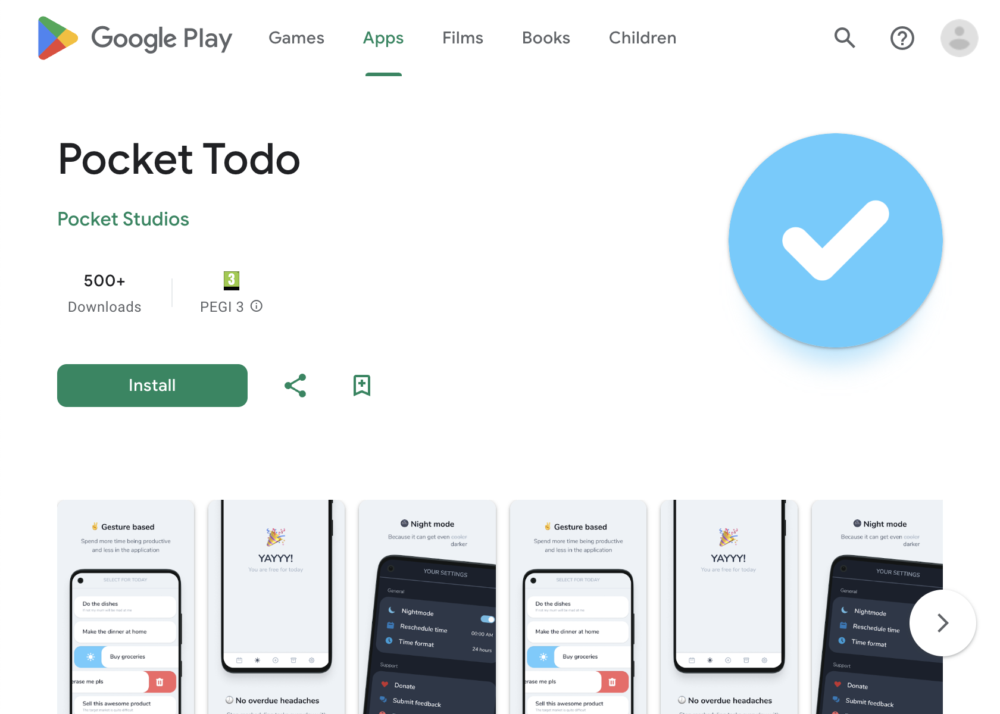

# Pocket Todo

Pocket Todo is a discontinued project that @ToniRealp, @EduardoGomezPueyo, and I (@vimtor) developed during our
university years. It was a simple to-do app aimed at being truly useful by providing an opinionated framework to
organize your tasks.

This repository contains the source code of the Android app made using Capacitor and Firebase for anyone to use.